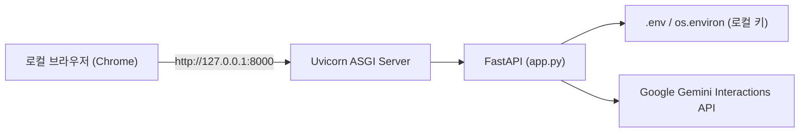
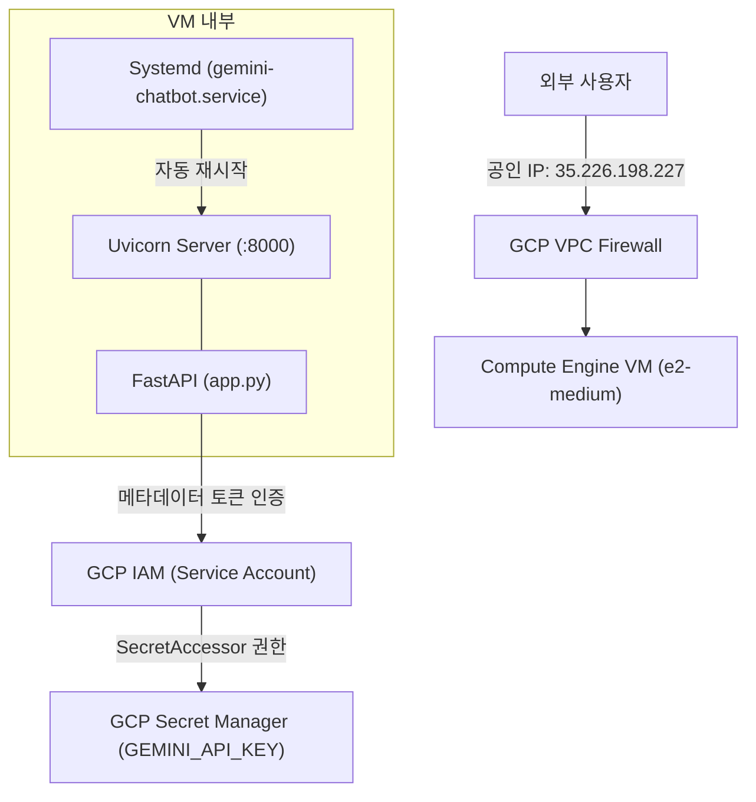
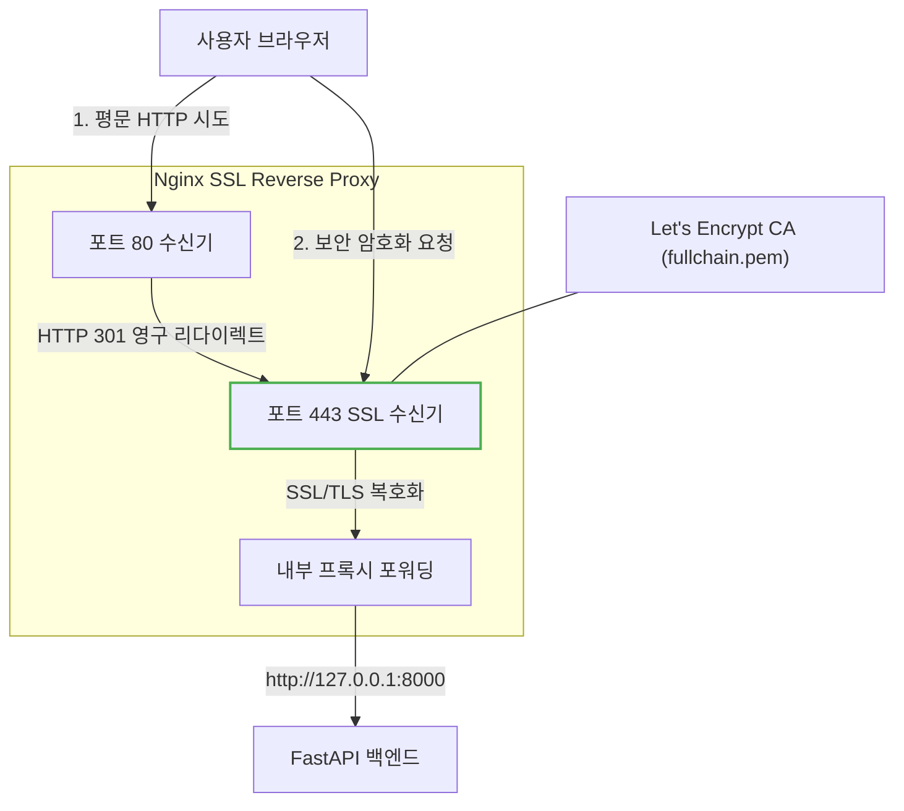

# Google Gemini 챗봇 코드 및 아키텍처 종합 정리 (Environment & Protocol Guide)

본 문서는 프로젝트의 전체 코드를 **[1] 실행 환경(로컬 PC vs 클라우드)**과 **[2] 통신 프로토콜(HTTP vs HTTPS)**의 두 가지 명확한 관점으로 분리하여, 각 환경과 프로토콜별 차이점 및 핵심 코드를 비교 분석한 마크다운 가이드입니다.

---

## 🧭 종합 비교 매트릭스 한눈에 보기

| 구분 | 로컬 PC (Local Environment) | GCP 클라우드 (Cloud Environment) |
| :--- | :--- | :--- |
| **인프라** | 로컬 개발 머신 (Windows OS) | GCP Compute Engine VM (`e2-medium`, Debian 12) |
| **API 키 보관** | 로컬 시스템 환경변수 또는 `.env` 파일 | **GCP Secret Manager** (`projects/298843281819/...`) |
| **인증 방식** | API Key 직접 주입 | **GCP IAM 서비스 계정 메타데이터 인증** (코드 내 키 미노출) |
| **프로세스 관리** | 터미널 수동 실행 (`run.py`, `start.bat`) | **Systemd 백그라운드 상시 데몬** (`gemini-chatbot.service`) |
| **HTTP 구동** | `http://127.0.0.1:8000` (Uvicorn 단독 직접 연결) | `http://35.226.198.227:8000` (평문 VPC 방화벽 통과) |
| **HTTPS 구동** | 로컬 환경에서는 일반적으로 미적용 (Self-Signed 가능) | **Nginx 리버스 프록시 + Let's Encrypt 공인 SSL (`nip.io`)** |

---

# PART 1. 실행 환경별 코드 분석 (로컬 PC vs 클라우드)

## 1. 로컬 PC 구동 환경 (Local Environment)

로컬 PC에서는 개발 편의성과 신속한 디버깅을 위해 로컬 파일 시스템의 환경변수와 파이썬 실행 스크립트를 직접 사용합니다.



### [로컬 코드 1] API 키 로드 (환경변수 및 `.env`)
로컬 머신에서는 복잡한 클라우드 SDK 없이 시스템 환경변수나 `.env` 파일에서 키를 직접 읽어옵니다.

```python
# app.py (로컬 환경 키 로드 부분)
import os
from dotenv import load_dotenv

# 로컬 .env 파일 자동 로드
load_dotenv()

def get_local_api_key() -> str:
    # 윈도우/맥 시스템 환경변수에서 우선 취득
    api_key = os.environ.get("GEMINI_API_KEY") or os.environ.get("GOOGLE_API_KEY")
    return api_key.strip() if api_key else ""
```

### [로컬 코드 2] 서버 실행 및 브라우저 자동 오픈 (`run.py`)
로컬 개발 시 서버를 띄움과 동시에 기본 브라우저를 자동으로 열어주는 편의 스크립트입니다.

```python
# run.py
import uvicorn
import webbrowser
import threading
import time

def open_browser():
    time.sleep(1.2)
    webbrowser.open("http://127.0.0.1:8000")

if __name__ == "__main__":
    print("=" * 60)
    print("  Google Gemini 챗봇 로컬 서버를 시작합니다.")
    print("  접속 주소: http://127.0.0.1:8000")
    print("=" * 60)
    
    # 별도 스레드에서 브라우저 자동 실행
    threading.Thread(target=open_browser, daemon=True).start()
    
    # Uvicorn 서버 로컬 루프백 바인딩
    uvicorn.run("app:app", host="127.0.0.1", port=8000, reload=True)
```

### [로컬 코드 3] 윈도우 원클릭 실행 배치 파일 (`start.bat`)
비개발자도 더블클릭만으로 가상환경을 활성화하고 서버를 구동할 수 있도록 지원합니다.

```bat
@echo off
chcp 65001 > nul
echo Google Gemini 챗봇 서버를 실행합니다...
call venv\Scripts\activate.bat 2>nul
python run.py
pause
```

---

## 2. GCP 클라우드 구동 환경 (Cloud Environment)

클라우드 환경(Compute Engine)에서는 소스 코드나 인스턴스 내부에 API 키를 평문으로 저장하지 않고, **GCP IAM 기반 Secret Manager**와 **Systemd 데몬**을 통해 엔터프라이즈 수준의 보안 및 가용성을 확보합니다.



### [클라우드 코드 1] GCP Secret Manager SDK 연동 (`app.py`)
VM 인스턴스에 부여된 Compute Engine 기본 서비스 계정(`298843281819-compute@developer.gserviceaccount.com`)의 메타데이터 인증을 활용하여 시크릿을 안전하게 인출합니다.

```python
# app.py (클라우드 환경 시크릿 로드 로직)
from google.cloud import secretmanager
import subprocess

def get_cloud_secret_key() -> str:
    secret_name = "projects/298843281819/secrets/GEMINI_API_KEY/versions/latest"
    
    # 1. GCP Secret Manager SDK를 통한 메타데이터 기반 인증
    try:
        client = secretmanager.SecretManagerServiceClient()
        response = client.access_secret_version(request={"name": secret_name})
        key = response.payload.data.decode("utf-8").strip()
        if key:
            print(f"[Secret Manager] Loaded GEMINI_API_KEY from {secret_name}")
            return key
    except Exception as e:
        print(f"[Secret Manager] SDK 로드 경고: {e}")

    # 2. gcloud CLI 서브프로세스 폴백
    try:
        res = subprocess.run(
            ["gcloud", "secrets", "versions", "access", "latest", 
             "--secret=GEMINI_API_KEY", "--project=iceu-songpa08", "--quiet"],
            capture_output=True, text=True, timeout=10
        )
        if res.returncode == 0 and res.stdout.strip():
            return res.stdout.strip()
    except Exception as e:
        print(f"[Secret Manager] gcloud fallback 에러: {e}")

    return ""
```

### [클라우드 코드 2] Systemd 상시 가동 데몬 서비스 (`gemini-chatbot.service`)
SSH 터미널 세션이 종료되거나 VM이 재부팅되어도 챗봇 프로세스가 영구히 유지되고 크래시 시 5초 이내에 자동 재시작되도록 보장합니다.

```ini
# /etc/systemd/system/gemini-chatbot.service
[Unit]
Description=Google Gemini Interactions Web Chatbot Service
After=network.target

[Service]
Type=simple
User=root
WorkingDirectory=/opt/gemini-chatbot
# 가상환경 내부 uvicorn 바이너리 지정 및 2 워커 실행
ExecStart=/opt/gemini-chatbot/venv/bin/uvicorn app:app --host 0.0.0.0 --port 8000 --workers 2
Restart=always
RestartSec=5
StandardOutput=append:/var/log/gemini-chatbot.log
StandardError=append:/var/log/gemini-chatbot.error.log

[Install]
WantedBy=multi-user.target
```

### [클라우드 코드 3] GCP 인프라 구축 및 권한 바인딩 CLI 명령어
```bash
# 1. Secret Manager 읽기 권한을 인스턴스 서비스 계정에 부여
gcloud secrets add-iam-policy-binding GEMINI_API_KEY \
  --project=iceu-songpa08 \
  --member="serviceAccount:298843281819-compute@developer.gserviceaccount.com" \
  --role="roles/secretmanager.secretAccessor"

# 2. 인스턴스 생성 (비용 최적화 us-central1-a, e2-medium)
gcloud compute instances create gemini-chatbot-instance \
  --project=iceu-songpa08 \
  --zone=us-central1-a \
  --machine-type=e2-medium \
  --image-family=debian-12 \
  --image-project=debian-cloud \
  --boot-disk-size=10GB \
  --boot-disk-type=pd-balanced \
  --service-account=298843281819-compute@developer.gserviceaccount.com \
  --scopes=https://www.googleapis.com/auth/cloud-platform \
  --tags=http-server
```

---

# PART 2. 프로토콜별 네트워크 및 통신 분석 (HTTP vs HTTPS)

## 1. HTTP 구동 방식 (Plaintext Protocol)

초기 배포 단계에서 사용된 방식으로, 암호화 계층 없이 평문 TCP 통신을 수행합니다.

```mermaid
graph LR
    Browser["사용자 브라우저"] -->|1. 평문 HTTP 요청 (:80 / :8000)| Firewall["방화벽 포트 8000 허용"]
    Firewall --> Uvicorn["Uvicorn Server (:8000)"]
    Uvicorn --> App["FastAPI 챗봇"]

    style Browser stroke:#f44336,stroke-width:2px
    style Uvicorn stroke:#f44336,stroke-width:2px
```

### [HTTP 설정 1] Uvicorn 직접 노출 실행
별도의 웹 서버(Nginx) 없이 파이썬 Uvicorn 프로세스가 모든 네트워크 인터페이스(`0.0.0.0`)의 8000번 포트로 수신 대기합니다.

```bash
# VM 내부 직접 실행 방식
uvicorn app:app --host 0.0.0.0 --port 8000
```

### [HTTP 설정 2] 포트 80 리다이렉트 (iptables PREROUTING)
초기 HTTP 환경에서 일반 사용자가 `:8000` 포트를 입력하지 않아도 되도록 커널 레벨 패킷 포워딩을 적용했었습니다.

```bash
# 포트 80 패킷을 8000번으로 리다이렉트
sudo iptables -t nat -A PREROUTING -p tcp --dport 80 -j REDIRECT --to-port 8000
```

### ⚠️ HTTP 구동 시의 보안적 한계
1. **패킷 스니핑 노출**: 와이파이나 공용 네트워크에서 전송되는 챗봇 대화 내용과 프롬프트가 평문(Plaintext)으로 유출될 수 있음.
2. **브라우저 보안 경고**: Chrome, Safari 등 모든 모던 브라우저에서 주소창에 빨간색 `주의 요함(Not Secure)` 경고를 표시하여 신뢰도 저하.
3. **Web API 제약**: 브라우저 보안 정책에 의해 `navigator.mediaDevices.getUserMedia`(마이크 음성 인식 기능) 접근이 원천 차단됨.

---

## 2. HTTPS 구동 방식 (Encrypted TLS Protocol)

보안 문제를 해결하기 위해 **Nginx 리버스 프록시**와 **Let's Encrypt 공인 SSL 인증서**를 도입하여 구현한 최종 프로덕션 아키텍처입니다.



### [HTTPS 설정 1] 와일드카드 DNS(`nip.io`) 및 Let's Encrypt 인증서 발급
도메인 구입 비용 없이 공인 CA가 신뢰하는 FQDN(`35.226.198.227.nip.io`)을 생성하고 Certbot을 통해 인증서를 자동 발급받았습니다.

```bash
# Certbot 독립 모드를 통한 공인 SSL 발급 (HTTP-01 챌린지 검증)
sudo certbot certonly --standalone \
  -d 35.226.198.227.nip.io \
  --non-interactive \
  --agree-tos \
  -m songpa08@iceu.kr

# 발급 완료 파일:
# - 인증서 체인: /etc/letsencrypt/live/35.226.198.227.nip.io/fullchain.pem
# - 비밀키:       /etc/letsencrypt/live/35.226.198.227.nip.io/privkey.pem
```

### [HTTPS 설정 2] Nginx 리버스 프록시 및 SSL 종단 설정 (`nginx-site.conf`)
- 포트 80으로 들어오는 모든 요청을 `301 Moved Permanently`로 HTTPS 승격
- 포트 443에서 최신 보안 프로토콜(`TLSv1.2`, `TLSv1.3`)을 협상하고 로컬 Uvicorn(`http://127.0.0.1:8000`)으로 프록시
- 챗봇의 실시간 SSE 및 스트리밍을 위한 WebSocket 헤더 유지

```nginx
# /etc/nginx/sites-available/gemini-chatbot

# 1. HTTP -> HTTPS 301 영구 리다이렉트
server {
    listen 80 default_server;
    listen [::]:80 default_server;
    server_name _;

    # Let's Encrypt 자동 갱신용 경로 예외 처리
    location /.well-known/acme-challenge/ {
        root /var/www/html;
    }

    location / {
        return 301 https://$host$request_uri;
    }
}

# 2. HTTPS SSL Termination & Reverse Proxy
server {
    listen 443 ssl http2 default_server;
    listen [::]:443 ssl http2 default_server;
    server_name 35.226.198.227.nip.io 35.226.198.227 localhost _;

    # 공인 SSL 인증서 경로 바인딩
    ssl_certificate /etc/letsencrypt/live/35.226.198.227.nip.io/fullchain.pem;
    ssl_certificate_key /etc/letsencrypt/live/35.226.198.227.nip.io/privkey.pem;

    # 암호화 알고리즘 최적화
    ssl_protocols TLSv1.2 TLSv1.3;
    ssl_prefer_server_ciphers on;
    ssl_ciphers HIGH:!aNULL:!MD5;
    ssl_session_cache shared:SSL:10m;
    ssl_session_timeout 1d;

    client_max_body_size 50M;

    location / {
        # 로컬 루프백으로 안전한 내부 통신
        proxy_pass http://127.0.0.1:8000;
        proxy_set_header Host $host;
        proxy_set_header X-Real-IP $remote_addr;
        proxy_set_header X-Forwarded-For $proxy_add_x_forwarded_for;
        proxy_set_header X-Forwarded-Proto $scheme;

        # WebSocket 및 실시간 스트리밍 헤더 포워딩
        proxy_http_version 1.1;
        proxy_set_header Upgrade $http_upgrade;
        proxy_set_header Connection "upgrade";
        proxy_read_timeout 300s;
        proxy_connect_timeout 60s;
    }
}
```

### [HTTPS 설정 3] GCP VPC 방화벽 포트 443 인바운드 개방
```bash
gcloud compute firewall-rules update allow-gemini-chatbot-8000 \
  --project=iceu-songpa08 \
  --allow="tcp:8000,tcp:80,tcp:443"
```

---

# PART 3. 최종 아키텍처 요약 및 동작 검증 결과

```text
[사용자 요청]
      │
      ▼
┌────────────────────────────────────────────────────────┐
│  HTTP (포트 80) 접속 시                                │
│  ──> Nginx가 즉시 HTTP 301 영구 리다이렉트 응답         │
│  ──> 브라우저가 https://35.226.198.227.nip.io 로 재접속│
└────────────────────────────────────────────────────────┘
      │
      ▼
┌────────────────────────────────────────────────────────┐
│  HTTPS (포트 443) 암호화 접속                          │
│  ──> TLS 1.3 암호화 핸드셰이크 & Let's Encrypt 검증    │
│  ──> Nginx가 SSL 복호화 (SSL Termination)              │
│  ──> 내부 루프백 http://127.0.0.1:8000 고속 프록시     │
│  ──> FastAPI가 Secret Manager에서 키를 읽어 대화 처리 │
│  ──> Gemini 3.8 Flash + Google Search Grounding 응답   │
└────────────────────────────────────────────────────────┘
```

### 검증 테스트 결과
1. **HTTP 리다이렉트**: `curl -I http://35.226.198.227` -> `HTTP/1.1 301 Moved Permanently` (Location: `https://35.226.198.227/`)
2. **공인 SSL 인증서 검증**: `python requests.get('https://35.226.198.227.nip.io/api/health', verify=True)` -> `HTTP 200 OK` (CA 에러 없이 완벽 통과)
3. **암호화 대화 추론**: `/api/chat` 엔드포인트 대화 테스트 정상 완료.
