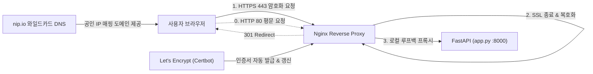

# Google Gemini 클라우드 웹 챗봇 (GCP Compute Engine & HTTPS)

> **Google Gemini 웹 UI 공식 디자인**을 기반으로 구축된 지능형 대화 챗봇으로, **Google Cloud Platform (Compute Engine)** 상에 **Let's Encrypt 공인 SSL/TLS (HTTPS)** 및 **Secret Manager**를 연동하여 완전한 보안 프로덕션 환경으로 배포되었습니다.

---

## 🌐 서비스 접속 URL

현재 클라우드 상에서 상시 가동 중이며, 전 세계 어디서든 웹 브라우저로 접속하실 수 있습니다:

- 🔒 **공인 HTTPS 접속 (권장 - 안전한 자물쇠 마크)**:  
  👉 **[https://35.226.198.227.nip.io](https://35.226.198.227.nip.io)**
- 🔒 **IP 직접 접속 (HTTPS)**:  
  👉 **[https://35.226.198.227](https://35.226.198.227)**
- 🔄 **HTTP 기본 접속 (HTTPS로 301 자동 리다이렉트)**:  
  👉 **[http://35.226.198.227](http://35.226.198.227)**

---

## 🔐 HTTP vs HTTPS 비교 및 프로토콜 전환 기술 분석

본 프로젝트는 초기에 **HTTP (포트 8000/80)** 평문 프로토콜로 구현되어 동작했으나, 패킷 스니핑 방지 및 웹 브라우저 보안 규격을 충족하기 위해 **HTTPS (포트 443)** 암호화 통신으로 고도화되었습니다.

### 1. HTTP vs HTTPS 핵심 차이점

| 비교 항목 | HTTP (평문 통신) | HTTPS (보안 암호화 통신) | 본 프로젝트의 개선 효과 |
| :--- | :--- | :--- | :--- |
| **통신 계층** | 애플리케이션 계층 (TCP 직결) | 전송 계층 보안 (TCP + TLS/SSL) | 전송 구간 내 모든 패킷 암호화 |
| **보안 위험** | 중간자 공격(MITM), 패킷 스니핑 노출 | 비대칭키(RSA/ECDSA) + 대칭키(AES) 혼합 암호화 | 챗봇 대화 내용 및 API 키 유출 원천 방지 |
| **데이터 무결성** | 변조 감지 불가 | 메시지 인증 코드 (MAC) 검증 | 전송 도중 패킷 위변조 차단 |
| **서버 인증** | 신원 보증 없음 (피싱 취약) | 공인 인증기관(CA) 디지털 인증서 | Let's Encrypt 인증서를 통한 신뢰 확보 |
| **브라우저 UI** | "주의 요함" / "안전하지 않음" | **안전한 녹색/자물쇠 아이콘** | 사용자 신뢰도 및 UX 대폭 향상 |
| **브라우저 API** | 마이크 음성 입력 등 보안 API 차단 | Web Speech API, 클립보드 등 전 기능 허용 | 마이크 음성 인식(STT) 정상 작동 |

---

### 2. HTTPS 구현을 위해 도입된 기술 스택 및 역할



1. **Nginx Reverse Proxy & SSL Termination**:
   - Uvicorn 파이썬 웹 서버 전면에 고성능 Nginx를 배치하여 TLS 악수(Handshake) 및 암복호화 연산을 Nginx가 처리합니다.
   - 내부 통신은 `127.0.0.1:8000` 로컬 루프백을 사용하여 백엔드 앱의 성능 저하를 방지했습니다.
2. **무료 와일드카드 DNS (`nip.io`)**:
   - 고정 도메인을 별도 구매하지 않고도 클라우드 공인 IP(`35.226.198.227`)에 즉시 매핑되는 완전한 FQDN(`35.226.198.227.nip.io`)을 확보했습니다.
3. **Let's Encrypt CA & ACME 프로토콜 (`Certbot`)**:
   - 전 세계 웹 브라우저가 신뢰하는 Let's Encrypt 루트 인증기관으로부터 HTTP-01 검증 챌린지를 통과하여 공인 SSL 인증서(`fullchain.pem`, `privkey.pem`)를 자동 발급받았습니다.
4. **HTTP 301 영구 리다이렉트 (Strict HTTPS Upgrade)**:
   - 사용자가 `http://`로 접속하더라도 Nginx가 즉시 `https://`로 주소를 변환하여 암호화되지 않은 세션 진입을 차단했습니다.
5. **GCP VPC 방화벽 (포트 443 인바운드 개방)**:
   - 구글 클라우드 방화벽 규칙 `allow-gemini-chatbot-8000`에 TCP 443 포트를 추가하여 외부 HTTPS 트래픽 인입을 허용했습니다.

---

## 🚀 프로젝트 주요 진행 사항 및 아키텍처

### 1. AI 엔진 & Interactions API
- **Gemini 3.8 Flash** (`models/gemini-3.8-flash`) 및 **Gemini 3.7 Flash** 탑재
- `google-genai`의 최신 **Interactions API (`client.interactions.create`)** 기반 추론
- **Google Search Grounding (`tools=[{'type': 'google_search'}]`)** 탑재로 실시간 최신 웹 검색 및 출처 인용 지원
- `thinking_level: 'medium'` 설정을 통한 다단계 추론 과정 지원

### 2. Gemini 스타일 프론트엔드 UI/UX
- 공식 Gemini UI (`https://gemini.google.com/app?hl=ko`) 디자인 가이드 완벽 구현
- **4대 추천 퀵 프롬프트 셀 탑재**:
  1. ⏱️ **시간 관리 루틴 제안**
  2. 💻 **비동기 파이썬 코드 작성**
  3. ☁️ **클라우드 아키텍처 전략**
  4. ✨ **프로젝트 기회 요약문**
- Markdown 실시간 렌더링, 코드 블록 하이라이트 및 원클릭 복사
- Web Speech API 기반 마이크 음성 입력 기능

### 3. 클라우드 인프라 (GCP Compute Engine)
- **비용 최적화 인프라**: 주피터 노트북 분석 기준 월 비용 최저가 1위 리전인 **`us-central1-a`**에 `e2-medium` (2 vCPU, 4GB RAM), `pd-balanced 10GB` 디스크로 인스턴스 생성
- **보안 자격증명 (GCP Secret Manager)**:
  - `projects/298843281819/secrets/GEMINI_API_KEY` 시크릿을 VM의 메타데이터 기반 IAM(`roles/secretmanager.secretAccessor`)으로 안전하게 자동 취득

---

## 📁 디렉토리 구조

```text
3주차/
├── README.md                      # 프로젝트 전체 총괄 가이드 (HTTP vs HTTPS 분석 포함)
├── deployment_log.md              # 클라우드 배포 및 HTTPS 구성 전 과정 상세 로그
├── CODE_SUMMARY.md                # 주요 소스 코드 구조 및 핵심 코드 마크다운 정리
└── 챗봇/
    └── compute_engine/
        ├── app.py                 # FastAPI 백엔드 (Interactions API, Secret Manager, Search)
        ├── run.py                 # 로컬 서버 실행 스크립트
        ├── start.bat              # 윈도우 원클릭 실행기
        ├── requirements.txt       # Python 의존성 목록
        ├── gemini-chatbot.service # Systemd 서비스 유닛 파일
        ├── nginx-site.conf        # Nginx HTTPS 리버스 프록시 설정
        ├── test_vm.py             # VM Secret Manager 연동 검증 스크립트
        ├── deployment_log.md      # 배포 작업 로그
        ├── README.md              # 챗봇 서브 프로젝트 가이드
        └── static/
            ├── index.html         # Gemini 웹 UI 마크업 (추천 셀 포함)
            ├── style.css          # Gemini 스타일 시트
            └── app.js             # 클라이언트 상호작용 및 API 호출 로직
```

---

## 💻 로컬 PC 실행 방법

```bash
# 1. 의존성 설치
pip install -r requirements.txt

# 2. 서버 실행
python run.py
```

---

## 🛡️ 과금 방지 가이드 (실습 종료 시)
```bash
# 1. 인스턴스 삭제
gcloud compute instances delete gemini-chatbot-instance --zone=us-central1-a --project=iceu-songpa08 --quiet

# 2. 방화벽 규칙 삭제
gcloud compute firewall-rules delete allow-gemini-chatbot-8000 --project=iceu-songpa08 --quiet
```
